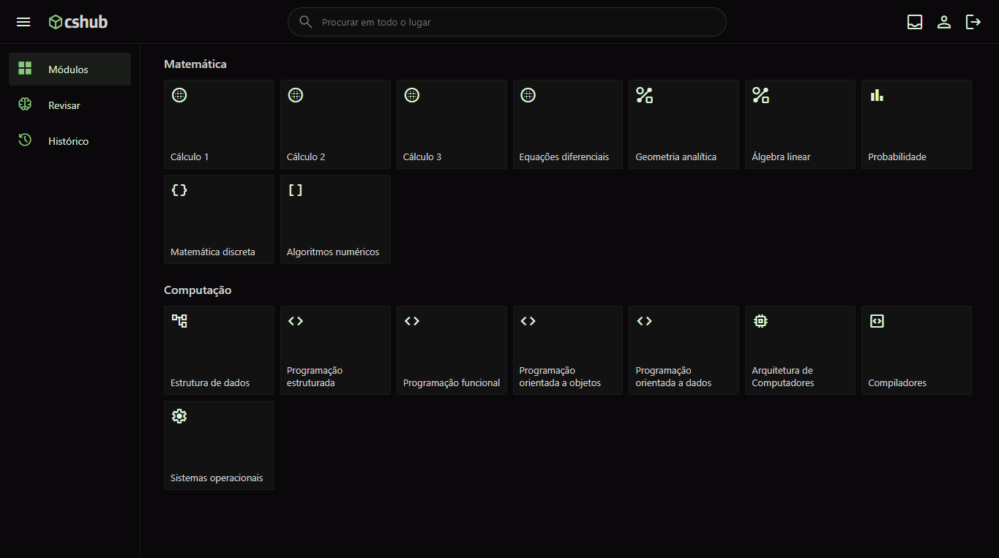

## cshub.web
cshub é uma plataforma de estudos sobre computação. Esse repositório contém a página web do cshub, escrito em 
Svelte. 

A página web é uma single-page application (SPA), e inicialmente comecei a desenvolvê-la em ReactJS. No entanto, 
reescrevi o projeto em SvelteJS por ser muito menos complexo que o React.

